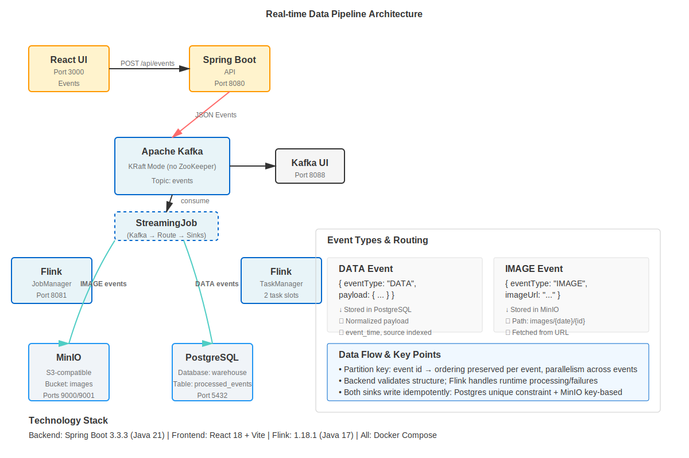
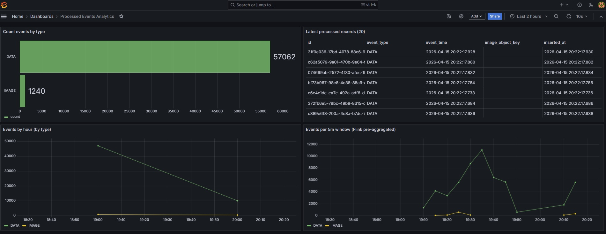

# Real-time Data Pipeline

## UI -> Spring Boot API -> Kafka -> Flink -> MinIO/Postgres

## Overview

This project is a local, Docker Compose–based real-time data pipeline:

- UI (React) sends events to the API
- API (Spring Boot) validates requests and publishes JSON events to Kafka
- Flink consumes Kafka events and processes them:
  - `IMAGE` events are stored in MinIO at `images/{date}/{id}.jpg`
  - `DATA` events are cleaned/normalized and stored in Postgres (`processed_events`)

## Architecture



- **frontend**: React + Vite built and served via Nginx
  - URL: http://localhost:3030
- **backend**: Spring Boot API that [receives](backend/src/main/java/com/memcyco/backend/api/EventController.java) requests, [validates](backend/src/main/java/com/memcyco/backend/model/EventRequest.java) input, and [publishes](backend/src/main/java/com/memcyco/backend/kafka/EventProducer.java) events to Kafka
  - URL: http://localhost:8030
- **kafka**: Kafka (KRaft mode, i.e. no ZooKeeper) + Kafka UI
  - URL: http://localhost:8088
- **flink**: Flink JobManager ([docker-compose.yml#L125-L147](docker-compose.yml#L125-L147)) / TaskManager ([docker-compose.yml#L148-L160](docker-compose.yml#L148-L160)) plus job submitter ([docker-compose.yml#L161-L186](docker-compose.yml#L161-L186)) that runs the streaming job ([StreamingJob.java](flink/src/main/java/com/memcyco/pipeline/StreamingJob.java), built via [flink/pom.xml](flink/pom.xml))
  - URL: http://localhost:8081
- **minio**: local S3-compatible object storage
  - Console: http://localhost:9001 (user: `minio`, pass: `minio123`)
- **postgres**: analytics database simulating a data warehouse
  - Conn: localhost:5432 (db: `warehouse`, user: `postgres`, pass: `postgres`)
- **grafana**: dashboards for Postgres analytics (pre-provisioned)
  - URL: http://localhost:3031 (user: `admin`, pass: `admin`)

## How to run

Prereqs:

- Docker Desktop
- Docker Compose v2

WSL:

- Run the scripts from a WSL shell (Bash)

```bash
# If needed, make scripts executable:
chmod +x scripts/*.sh

./scripts/up.sh
```

Additional commands:

```bash
./scripts/ps.sh
./scripts/logs.sh
./scripts/logs.sh --errors
./scripts/logs.sh backend
./scripts/logs.sh --errors backend
./scripts/restart.sh        # rebuilds and restarts the full stack.
./scripts/down.sh           # stops the stack, keeps all volumes (data persists).
./scripts/clean.sh --prune  # stops the stack, removes all volumes (data lost), removes orphans, and optionally prunes dangling images.
```

Then:

- Open UI at http://localhost:3030
- Send `DATA` or `IMAGE` events

## Analytics Queries

All analytics queries are defined in [samples/analytics.sql](samples/analytics.sql) and query PostgreSQL. They differ in _when_ they are computed:

**Post-hoc analytics** (computed at query time):

- Count events by type
- Retrieve latest records
- Aggregate by hour

These scan the `processed_events` table and run standard SQL aggregations. Flink is not involved.

**Real-time analytics** (pre-aggregated by Flink):

- 5-minute tumbling-window event count per `eventType` (stored in `event_type_counts_5m`)
- Flink computes continuously; queries read pre-computed results (no query-time latency)

**Flink windowing behavior:**

The 5-minute tumbling-window aggregation ([StreamingJob.java:104-124](flink/src/main/java/com/memcyco/pipeline/StreamingJob.java)) uses Flink's default behavior: it only emits window results for windows that contain at least one event. Empty windows are not materialized. This means the `event_type_counts_5m` table will only have rows for time periods when events actually arrived. If there are no `DATA` events in a 5-minute window, that window will not appear in the results, even if the same period had `IMAGE` events. This is standard Flink behavior and conserves storage; to include all windows (including empty ones), the job would need explicit late-firing or allowed lateness policies.

### Running the queries:

Via CLI:

```bash
./scripts/sql-file.sh samples/analytics.sql
```

Via Grafana dashboard:
Access [http://localhost:3031](http://localhost:3031/d/processed-events/processed-events-analytics?orgId=1&refresh=10s) (user: `admin`, pass: `admin`), then:

- Dashboards → Browse → **Processed Events Analytics**

Both CLI and Grafana execute the same SQL against PostgreSQL; the difference is presentation (one-off results vs. live dashboard). The "Flink pre-aggregated" panel reads from `event_type_counts_5m`, while the others query `processed_events` at query time.



## Notes / decisions

- Events are serialized as JSON strings in Kafka. (To view events: see [Architecture](#architecture) and open Kafka UI topic `events`.)
- A single Kafka topic (`events`) is used to keep the pipeline minimal and because both event types share the same lifecycle (ingest -> process -> sink). It makes sense to split topics when:
  - You need different retention/compaction policies per event type.
  - You want independent scaling/quotas/ACLs per event type (e.g. high-volume `IMAGE` vs low-volume `DATA`).
  - Different teams/consumers own different event streams and you want isolation.
- The Kafka partition key is the event `id` (UUID) so all retries/duplicates for the same logical event are consistently routed to the same partition, and ordering is preserved for that key. Across different ids, ordering is intentionally not guaranteed (to allow parallelism).
- Backend validation vs Flink validation:
  - The backend validates request structure and basic constraints (e.g. required fields like `eventType`) before publishing.
  - The backend can also do lightweight checks for `IMAGE` URLs (e.g. non-empty, valid URL syntax, allowed schemes), but it should avoid heavy validation (fetching the URL, checking content-type/size) because that adds latency, can be flaky, and couples ingestion to external availability.
  - Flink is responsible for runtime validation/handling during processing (e.g. attempting to fetch the image, dealing with HTTP failures/timeouts, and deciding whether to drop/route to a DLQ if you add one).
- The Flink job uses routing based on `eventType` and writes to two different sinks (Postgres for `DATA`, MinIO for `IMAGE`).
- MinIO bucket `images` is created by `minio-init` on startup. (To browse stored images: see [Architecture](#architecture).)

## Error handling and high availability (HA)

This repository is a local, single-node demo (single Kafka broker, single Postgres, single MinIO, single Flink JobManager/TaskManager). In production you would scale/replicate these components and harden failure handling.

At a high level, the pipeline aims for "at-least-once" processing semantics:

- Kafka is the durable buffer between ingestion (backend) and processing (Flink).
- Flink processes streams continuously; if it restarts, it may reprocess some messages unless you enforce idempotency in sinks.

Key considerations:

- **Backend -> Kafka**
  - The backend should validate and reject malformed requests before publishing.
  - On publish failures, a production service would typically retry with backoff and return an error to the caller if it cannot enqueue.

- **Kafka durability / availability**
  - For HA you would run multiple brokers and set replication factor > 1.
  - Topics, retention policies, and partitions should reflect throughput and replay needs.

- **Flink fault tolerance**
  - Production jobs typically enable checkpointing and configure restart strategies.
  - If checkpointing is enabled and sinks participate correctly, Flink can recover and resume from the last successful checkpoint.

- **Sinks (Postgres / MinIO)**
  - Network/database/object-store outages are expected; sinks should use retries with bounded backoff and clear failure modes.
  - To avoid duplicates under retries/restarts, make writes idempotent where possible:
    - Postgres: use a unique constraint on `id` and insert with upsert semantics.
    - MinIO: object keys derived from event `id` are naturally idempotent (overwrite is safe if content is deterministic).

- **Poison messages and DLQ**
  - For unprocessable events (bad schema, broken URL, unexpected payload), a common pattern is to route failures to a "dead-letter" topic/stream with the error reason, instead of crashing the job.
